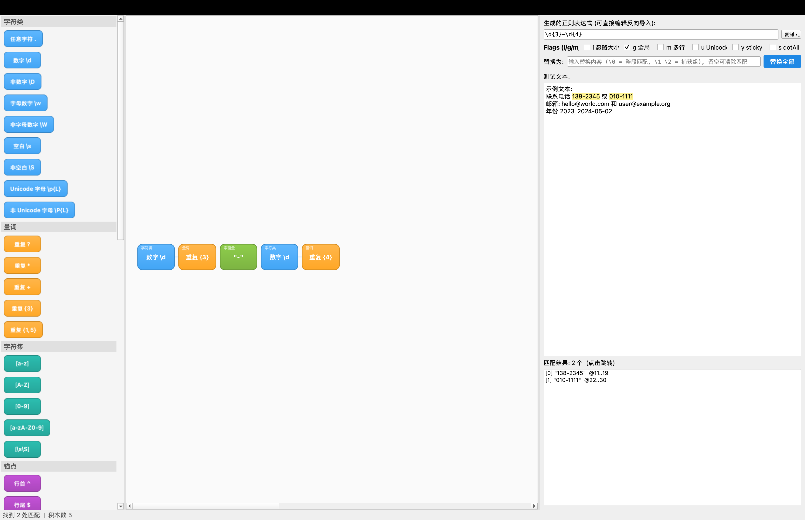

# RegexBlocks · 可视化正则表达式构建器

像搭积木一样直观地构建和测试正则表达式，无需记忆复杂的符号语法。



---

## 核心亮点

### 🧩 Scratch 风格积木系统
- **22 种可视化积木**：字符类、量词、字符集、锚点、字面量、分支逻辑
- **物理嵌套分组容器**：支持捕获组 `(...)` 和非捕获组 `(?:...)`，子积木自由拖入/拖出、任意嵌套
- **Material Design 配色**：6 类语义颜色，浅色/暗色模式都清晰

### ↔️ 双向编辑
- **积木 → 正则**：拖拽积木时，右上角正则表达式 60Hz 实时刷新
- **正则 → 积木**：直接在文本框输入正则，按 Enter 自动解析为积木树并布局
- **一键导出**：PCRE / C++ Qt / Python / JavaScript / Java / Rust 代码片段，自动转换 flags

### ✨ 专业级交互体验
- **智能拖拽**：量词自动吸附到可修饰项后方，拖动主块时量词跟随移动
- **实时反馈**：蓝色鬼影预览、容器高亮、100ms 缓动滑入动画
- **多选操作**：⌘/Ctrl + 单击多选、整体同步拖动
- **直观删除**：选中按 Delete，或拖出画布到红色区域自动删除

### 🔍 即时匹配测试
- **6 个正则选项**：忽略大小写、全局、多行、Unicode、Sticky、DotAll
- **自动高亮**：测试文本中所有匹配段落实时高亮显示
- **捕获组列表**：匹配结果中的分组捕获一目了然
- **一键替换**：支持 `\0` `\1` `\2` 等捕获组引用，替换可撤销

---

## 快速开始

### 常用正则一键加载

| 快捷键 | 模板 |
|--------|------|
| ⌘1 / Ctrl+1 | 邮箱验证 |
| ⌘2 / Ctrl+2 | 中国手机号 |
| ⌘3 / Ctrl+3 | URL 匹配 |
| ⌘4 / Ctrl+4 | IPv4 地址 |
| ⌘5 / Ctrl+5 | ISO 日期 |
| ⌘6 / Ctrl+6 | 十六进制颜色 |
| ⌘7 / Ctrl+7 | 整数匹配 |

### 构建正则三步走

1. **拖**：从左侧积木库拖入画布
2. **编**：双击积木编辑参数（量词范围、字符集内容等）
3. **测**：右侧输入测试文本，实时查看匹配结果

---

## 跨平台兼容

| 语言 | 库 | 引擎 |
|------|-----|------|
| Python | `re` | PCRE-like |
| JavaScript | `RegExp` | Irregexp |
| Java | `java.util.regex.Pattern` | PCRE-like |
| Rust | `fancy-regex` | 回溯 VM |
| C++ Qt | `QRegularExpression` | PCRE2 |

生成的正则表达式在上述语言中原样可用，无需转换。

---

## 技术栈

- **语言**: C++17
- **框架**: Qt 6 Widgets
- **构建**: CMake + Ninja
- **支持平台**: macOS / Windows / Linux

---

## 构建运行

### macOS (Homebrew)

```bash
brew install qt cmake ninja
./scripts/build-mac.sh
open ./build/RegexBlocks.app
```

### Windows

```bat
scripts\build-windows.bat
build\RegexBlocks.exe
```

### Linux

```bash
# Ubuntu/Debian
sudo apt install qt6-base-dev cmake ninja-build
./scripts/build-linux.sh
./build/RegexBlocks
```

---

## 应用截图

**浅色模式 - 积木编辑**

```
┌─────────────────────────────────────────────────────────┐
│  积木库    │  画布                          │  正则表达式  │
│  ──────────┼────────────────────────────────┼────────────  │
│  • 字符类  │  ┌───┐ ┌───┐ ┌─────┐         │  \d{3}-\d{4} │
│  • 量词    │  │\d│ │{3}│ │  -  │         │              │
│  • 字符集  │  └───┘ └───┘ └──┬──┘ ┌───┐   │              │
│  • 锚点    │                   │    │\d│   │              │
│  • 分组    │                   └────│{4}│   │              │
│            │                        └───┘   │              │
└─────────────────────────────────────────────────────────┘
```

**暗色模式 - 分组嵌套**

```
┌─────────────────────────────────────────────────────────┐
│  (分组容器)                        │  匹配高亮          │
│  ┌─────────────────────────┐      │  • 138-1234 ✓     │
│  │ ┌───┐ ┌───┐  或  ┌───┐ │      │  • 010-5678 ✓     │
│  │ │1\d│ │{9}│  │   │\d{4}│ │      │  • abc-defg ✗     │
│  │ └───┘ └───┘      └───┘ │      │                   │
│  └─────────────────────────┘      └───────────────────┘
└─────────────────────────────────────────────────────────┘
```

---

## 使用场景

- 🎓 **学习正则**：通过可视化积木理解正则语法结构
- 🔧 **调试复杂模式**：分组嵌套、分支逻辑一目了然
- 📋 **代码生成**：一键生成多语言代码片段
- 📚 **团队协作**：保存 `.regexblocks` 文件分享配方

---

## 键盘快捷键

| 操作 | macOS | Windows/Linux |
|------|-------|---------------|
| 新建配方 | ⌘N | Ctrl+N |
| 打开配方 | ⌘O | Ctrl+O |
| 保存配方 | ⌘S | Ctrl+S |
| 撤销 | ⌘Z | Ctrl+Z |
| 重做 | ⌘⇧Z | Ctrl+Y |
| 删除积木 | ⌫ | Delete |
| 复制积木 | ⌘D | Ctrl+D |

---

## 配方文件

项目使用 `.regexblocks` JSON 格式保存积木布局、测试文本和正则选项，便于分享和版本控制。

```json
{
  "version": 4,
  "blocks": [
    {"type": "charClass", "klass": "\\d"},
    {"type": "quantifier", "min": 3, "max": 3},
    {"type": "literal", "value": "-"},
    {"type": "charClass", "klass": "\\d"},
    {"type": "quantifier", "min": 4, "max": 4}
  ],
  "testText": "联系电话 138-1234",
  "flags": ["g"]
}
```

---

**RegexBlocks** — 让正则表达式变得简单、直观、有趣。
